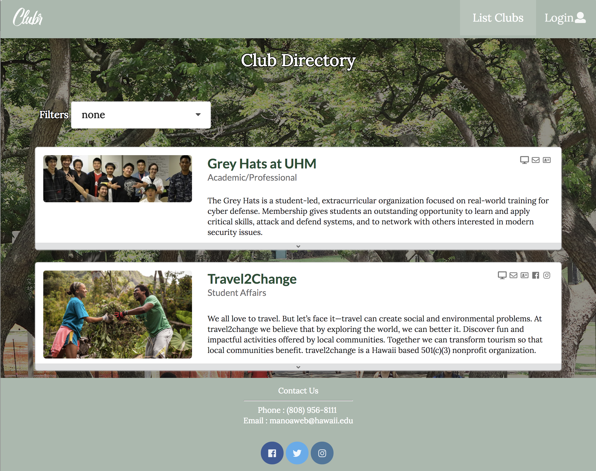
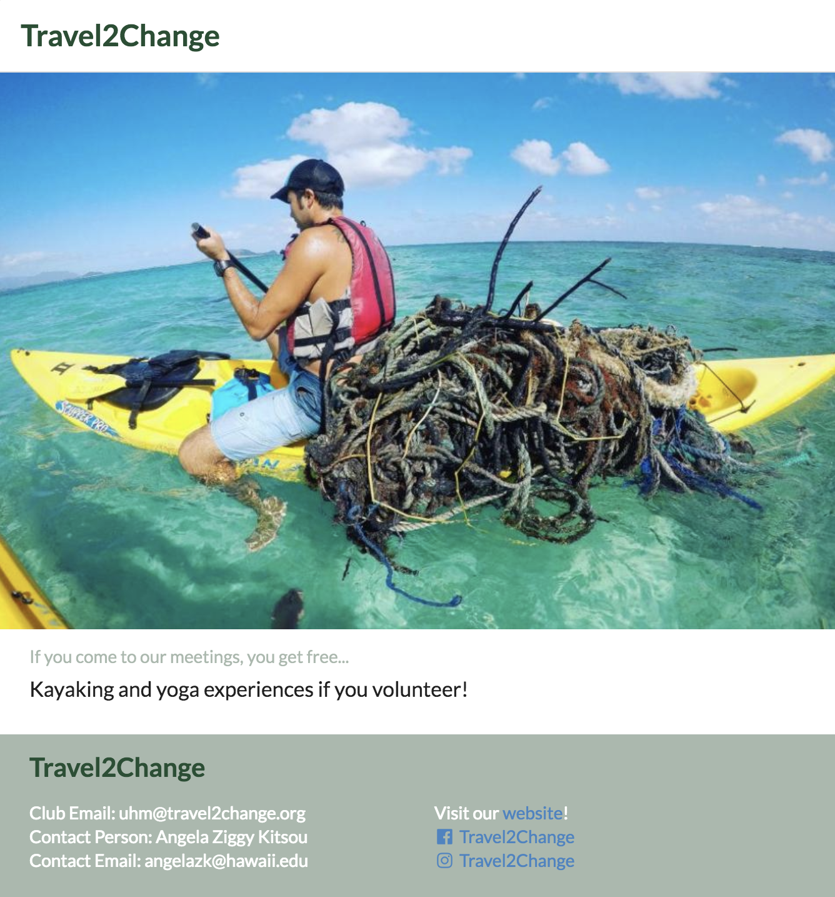

# UH Clubr

  
  

### The Project
ADD!!!

  
  

### My Contribution
ADD!!!

### Lessons Learned
ADD!!!

To learn more about our UH Clubr web application, check out our deployed <a href="http://uhclubr.meteorapp.com">website</a>, <a href="https://uh-clubr.github.io/">github.io page</a> or <a href="https://github.com/uh-clubr/uh-clubr">github repository</a>. Happy reading!