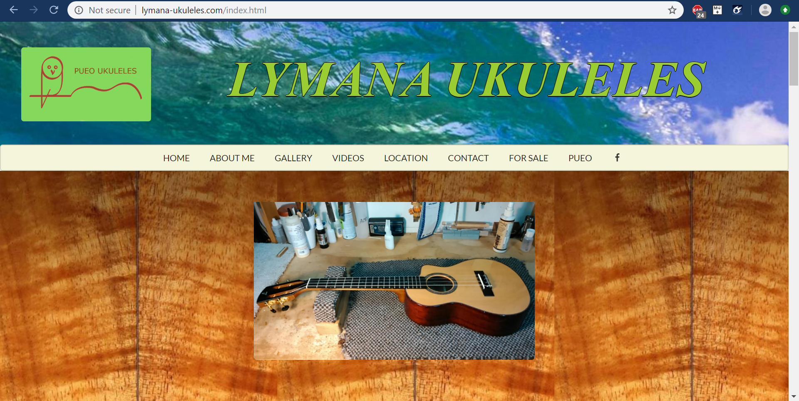

          Link : [Lymana Ukuleles](http://lymana-ukuleles.com/)

## SOME FEATURES:
* Built using HTML & CSS with Semantic UI framework
* Google Maps integration with API key from Google G Suite account
* PayPal implementation. Used their button code from their site.
* Embedded multiple Youtube and Vimeo videos across the site.
* Unique favicon (small icon that appears in the web bar)
* Clicking the Facebook icon in the navbar opens up the business's actual Facebook page in a new tab.
* Avoided hosting fees by using free Github Pages. Changed .github.io extension to custom domain name with GoDaddy.

## BACKSTORY:
Growing up, my Uncle Lyman was like a father to me. He would take me fishing, surfing, and teach me all sorts 
of useful and practical things. Uncle Lyman was always a very talented craftsman; he could build and fix anything
and everything. My first exposure to his skill was when I was involved in Boy Scouts. In Boy Scouts, we had an 
annual racecar competition. The point of the competition was to build a small, wooden racecar and race it against the other
scouts. The scouts could receive assistance in building their car from a family member. I remember Uncle Lyman
helped me to build an amazing car. The wood was polished so well that when I touched it, it felt like velvet. He made
the car aerodynamic and fast. I remember our car won the derby that year, all thanks to Uncle Lyman's superior craftsmanship.

The wooden car was just a small sample of his ability. Eventually I would spend time in Uncle Lyman's actual studio:
the place where he made ukuleles. Uncle Lyman builds amazing and world renowned custom ukuleles. He calls his business
Lymana Ukuleles. He would always talk about wanting a website for his business, but could never get one that he was 
satisfied with (formats such as Weebly just weren't ideal). Since I now knew HTML/CSS, I decided to make him a website
the good old fashioned way.

## PROCESS:
Interestingly enough, this project began with searching through reddit. Uncle Lyman first wanted a logo. He wanted something with "an owl and a ukulele". I am not much of a drawer, so instead of trying to draw something on my own, I consulted reddit. I asked the logo subreddit to create what Uncle Lyman had asked for. Eventually a user created something I thought was simple and nice, and Uncle Lyman agreed once I showed him. In today's world, oftentimes knowing how to be resourceful online is incredibly useful. I did do further edits on the logo using the GIMP photo editor.

Now to begin the project of building the actual website, I first began experimenting with HTML and CSS code in the [IntelliJ IDE](https://www.jetbrains.com/idea/). I also used the Semantic UI framework to help make working with the HTML and CSS easier (view my essay on my Semantic UI experience [here]({{ site.baseurl }}/essays/Getting%20Frameworked.html)). Eventually, after a lot of trial-and-error, I managed to create something I was satisfied with. Even though the website was not completely refined, I decided to leave it as be because I felt it had some charm and character.