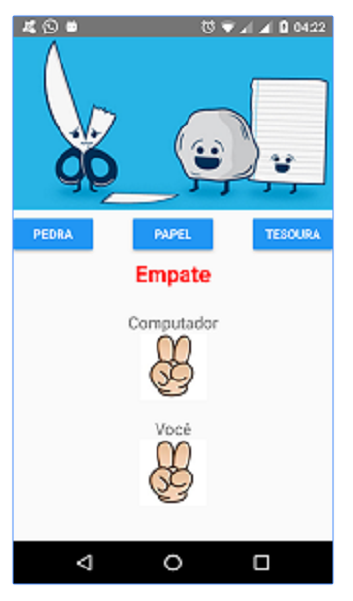

  
  
  

  
  

Aplicativos hospedados no <a href="https://play.google.com/store/search?q=alexjosesilva&hl=pt_BR">GooglePlay</a>

Mais sobre o app [Repositorio]

Source: <a href="https://github.com/alexjosesilva/Curso-React-Native">
	<i class="large github icon"></i> Apps
</a>

