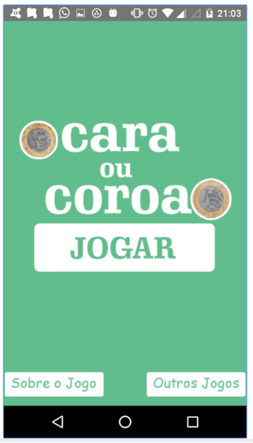
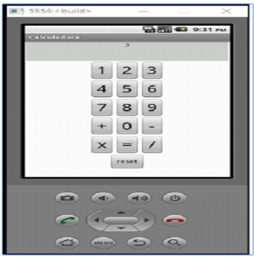
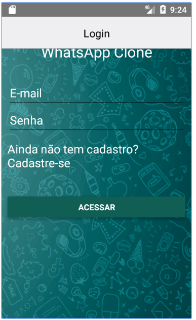

  
  
  

  
  

Mais sobre o app [Repositorio]

Source: <a href="https://github.com/alexjosesilva/Curso-React-Native">
			<i class="large github icon"></i> Apps
		</a>

Url: <a href="https://play.google.com/store/search?q=alexjosesilva&hl=pt_BR">
			<i class="large fa-google-play icon"></i> Apps
	</a>
