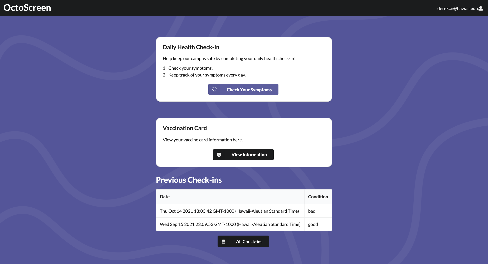
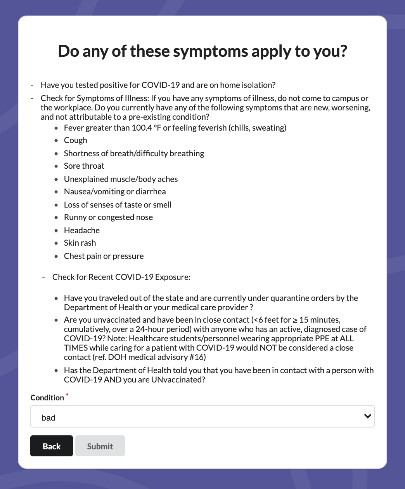
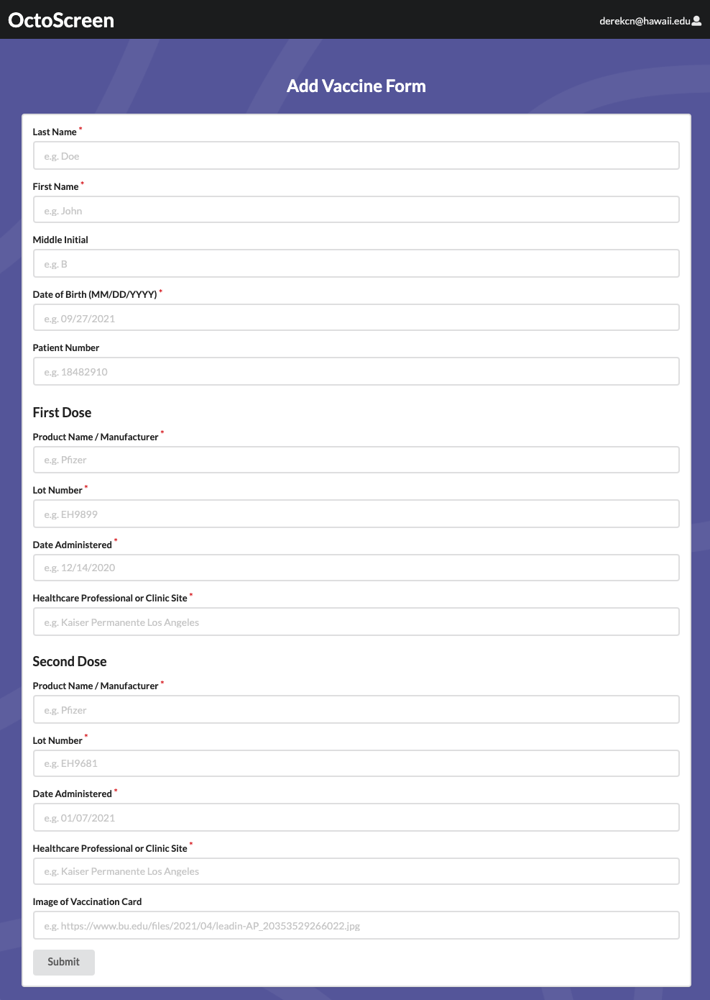
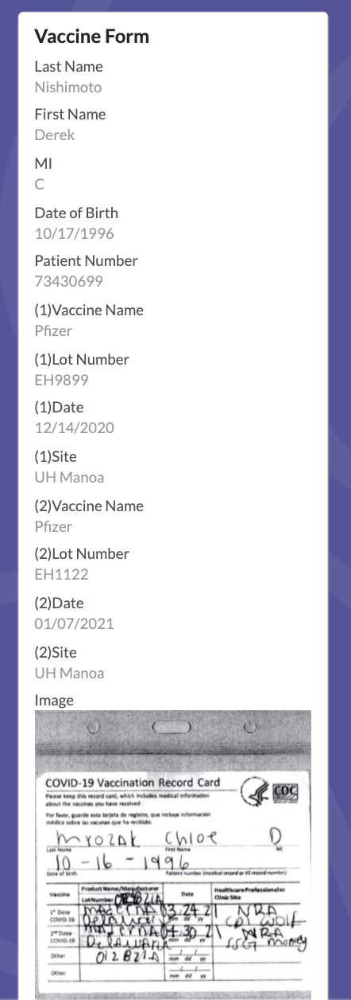

    During the fall of 2021, I had the opportunity to work on a group software engineering project for my ICS491 course. We used many new technologies we had been working with throughout the semester including Meteor, MongoDB, and React JS with semantic UI. Our group of 4 was assigned a project to build a web application for COVID tracking, thus we began working on octo-screen.

    The first purpose of octo-screen is to provide a daily health check-in service to people to specify whether or not they are experiencing any COVID symptoms. Each persons condition determines if they are allowed to enter campus that day. After logging into an account, users will be presented with a page where they are able to submit a form which indicates whether or not they are experiencing any COVID symptoms. The user can also resubmit a form if they wish to update their status for that day. 
   

    In addition to providing a health check-in service, the second purpose of this application is to provide a record for all submitions made by a particular user. This record shows the dates and times of all previously submitted forms, as well as an indication of COVID status for each submition. In order for this to be possible, it required us to save and store submitted forms to a database, for our project we used MongoDB. 
    

  
    The third purpose of octo-screen is to allow user to upload vaccine information. This data includes information such as, when a vaccine was administered, the type of vaccine, and the lot number. There is also an option for users to upload a photo of their vaccine card if they choose to. After submitting a vaccine information form, users can view their submitted information on a different page. Resubmissions are also accepted if updates need to be made. 
   

    Although we ran into some minor difficulties while building and deploying this application, overall everything went pretty smoothly, for the most part. I learned a lot about the process of developing software, and how to better interact with a team of software engineers. It was a great experience to work on a team of capable developers who each brought their own creativity and insight into creating octo-screen. 

Team Members:
Jason Kulka: <a href="https://github.com/jkulka">github</a>
Kason Shiroma: <a href="https://github.com/kasons">github</a>
Keanu Lagundimao: <a href="https://github.com/yatfu">github</a>

Project: <a href="https://github.com/ics491-kkj/octo-screen">github</a>
App: <a href="https://octo-screen.meteorapp.com/">octo-screen</a>
