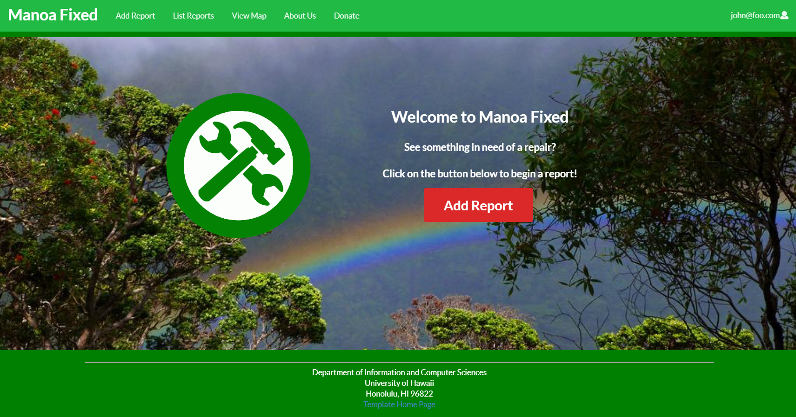

## INTRODUCTION:
For my Software Engineering class, my final project was to create some type of web app for the university within a team. After some thinking, my team and I decided we wanted to work with the maintenance department and help them out
in some way. The idea we had was to develop an app that would be able to create and organize repair reports online. We thought this would be useful to the department and could help increase the department's overall efficiency. 

## PROCESS:
Over several weeks, my team and I worked on this project, coding and making small adjustments to the site. We logged all of our progress through Github's Project Board system and also managed a Github Page to document the project. The basic premise of the app is that General Users can add reports and view a listing of reports, while Admins have the power to edit and remove reports. Also, I put some PayPal and Cloudinary integration into the site. Overall this was a great learning experience between working with a team and the actual coding itself.

## MY CONTRIBUTION:
Here I will list some specific contributions I had to the project...

* Wrote and managed virtually the entire Github Page from start to finish. Documented our project progress.
* Brought over Cloudinary code from RadGrad and translated it from TypeScript to JavaScript for our site.
* Used code given on PayPal to add a Donate feature.
* Changed Add Report form to make it more organized. Replaced Email field with Title field, since Email was redundant.
* Added placeholder text throughout forms found on the site.
* Gave character limits to certain submit fields on the site.
* Gave Image a default value in the schema, this being a URL to an image in my Cloudinary.
* Changed Image submit in Edit Report from being a raw URL to an upload button in Cloudinary, similar to Add Report.
* Moved certain schema values into a "View Attribute" PopUp.
* Added a Hidden Date field in the Reports schema.
* Conceptualized the Status feature and helped inmplement it in the Reports schema. Made it so only Admins can change it.
* Got Community Feedback.

## FINAL THOUGHTS
I am overall satisfied with the project. I think it does have some niche use within the maintenence department, I would be interested in seeing it actually in use and if it can benefit them in the long run. My experience working with a team was a mixed-bag; I am thankful for their contributions and it is nice being able to have other people take on some of the workload, however it is inevitable to evenually run into disagreements with members regarding site concepts. For example, I do not want My Reports and All Reports to be separated, I would rather just have it as List Reports as it first was. This is because I wanted the site to be more of a "bulletin board" where people post reports and that is it. This isn't a site to follow a users individual submissions, since that is not the main point of the site. Following individual submissions could have more of a use on a "Buy-&-Sell" sort of site, but not this one. Also, I wanted the Status field to be inside the View Attributes tab, since I think it looks messy outside of it (especially with the other tags directly below it). Overall it was a great learning experience.

## RESULT:
You can view the live app on Galaxy [here](http://manoafixed.meteorapp.com/#/).

You can view the Project Page [here](https://manoa-fixed.github.io/).

You can view the Github repo [here](https://github.com/manoa-fixed).

***************************************************************************************

