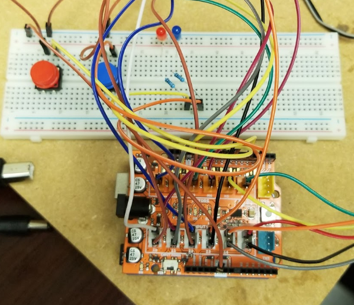
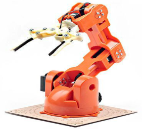

<div class="ui small rounded images">
  
  
</div>

## About Me

The goal of this project was to find an effective way to use this brain controller interface technology called [Emotiv Epoc+](https://www.emotiv.com/) for the benefit of the user. This technology is still quite new and not many advancements have been made to find out the full extent of the device’s capabilities. The motivation behind this project was to explore the capabilities of the Emotiv Epoc+ for future ambient lab use. We would develop a test case for controlling a robotic arm mostly unassisted. The goal of this was to aim at helping those with movement disabilities. Other ideas were to explore its capabilities as a gaming device.

## My Contributions

For this project, I was the lead programmer who was responsible for getting the Emotiv headset to communicate with the arm. To do this I used the existing prebuilt libraries for the Emotiv Epoc+ to gather motion data and send commands via serial to Arduino. I then programmed the Arduino to interpret commands and adjust the servos in the Braccio arm accordingly with specific head movements. The final design had 12 mappable commands to control the servos using two buttons and four head commands.

## Reflections

This was a very interesting project that I learned a lot from. It was difficult from the start because the existing prebuilt libraries were made in C#, so we had to quickly learn the basics as no one in our group had prior experience with the language. Once we figured that out it was easy getting the arm to communicate with the headset, however, getting it to work smoothly was a challenge. The biggest problem we had in the project was breaking the servos that motorized the arm from improper use. We learned that it was bad to move the arm manually because the servos eventually built up a large enough charge to blow up the controller chip for the servo. Overall, it was a good learning experience because I learned a new language and learned how to properly take care of servos.

Here is some code that illustrates how send data from the Emotiv controller to the arm:

```C#
if ((float)motionData[7] > 8300f)
{
    Console.WriteLine("Moving up");
    port.WriteLine("#UPPP\n");
}
if ((float)motionData[7] > 8175f)
{
    Console.WriteLine("Moving down");
    port.WriteLine("#DOWN\n");
}
if ((float)motionData[8] > 8320f)
{
    Console.WriteLine("Moving left");
    port.WriteLine("#LEFT\n");
}
if ((float)motionData[8] > 8100f)
{
    Console.WriteLine("Moving right");
    port.WriteLine("#RITE\n");
}
```
<hr>
<div class="ui embed"data-source="https://youtu.be/ennlXDwQofc"data-id="ennlXDwQofc">
</div>

Source: <a href="https://github.com/nchu277/EE396"><i class="large github icon "></i>emotiv/ee-396-text-project</a>


