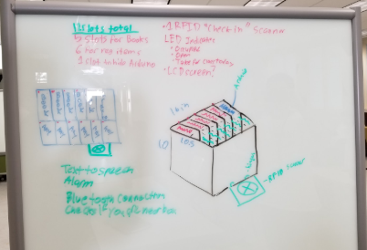
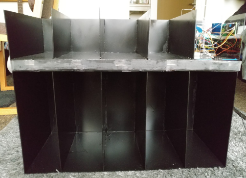

  
  

## About Me

Smart Cubby is a bookshelf-like cubby that interacts with a phone application that I helped create as a team project in EE 296, Fall 2017. The project helped me learn how use an Arduino as well as create simple apps using MIT App Inventor. Smart Cubby was designed using an Arduino to control LED’s, an RFID scanner, an LCD module as a clock. It was implemented using MIT App Inventor, a website platform you can use to create complex android application in a simple way. Within five weeks, we created an app that fully interacted with the Arduino using Bluetooth. The app was used to set a student’s weekly class schedule and set an alarm to wake the student up when they would need to start the day.

## My Contributions

I came up with the idea of the project as well as the design of it. I was the lead coder that developed the MIT App Inventor pair app for the Smart Cubby as well as the Arduino coder where I implemented the functions of the LEDs, the RFID scanner, the LCD time display, push buttons, and alarm buzzer. I also helped with the construction of the plexiglass cubby cutting the plexiglass and binding the pieces together with epoxy.

## Problems

The construction of the plexiglass was not optimal as the thickness of the plexiglass did not provide a strong enough structure. The final project ended up fully functional but very fragile. If we were to make improvements to the project, it would be to build it out of wood next time. It was also extremely difficult to score the plexiglass to make precise cuts, so we ended up with a lot of pieces that were not useable.

<pre>

## Design
-Bookshelf style approach
-Plexiglass construction
-Has 10 compartments: 1 slot the Arduino microcontroller, 5 slots for textbooks, and 4 slots for miscellaneous items
-Time displayed through LCD
-Two pushbuttons to program the clock
-Individual LEDs per a compartment
-Piezo buzzer alarm
-RFID scanner
-Schedule and LED controller in MIT App Inventor

## Android App
-User can program his/her schedule into the app
-User can make edits to an already programed schedule 
-User can  turn off the LEDs

## What We Learned
-Advanced app functions (i.e. programmable scheduler) in MIT App Inventor
-App graphic design
-I2C data transfer protocol
-LCD module as a clock
-Piezo buzzer as an alarm
-Plexiglass cutting 
-RFID scanning technology
-Use of a soldering iron
-Charlieplexing
 
</pre>

If you would like to learn more about MIT App Inventor click [here](https://appinventor.mit.edu/about-us). 
