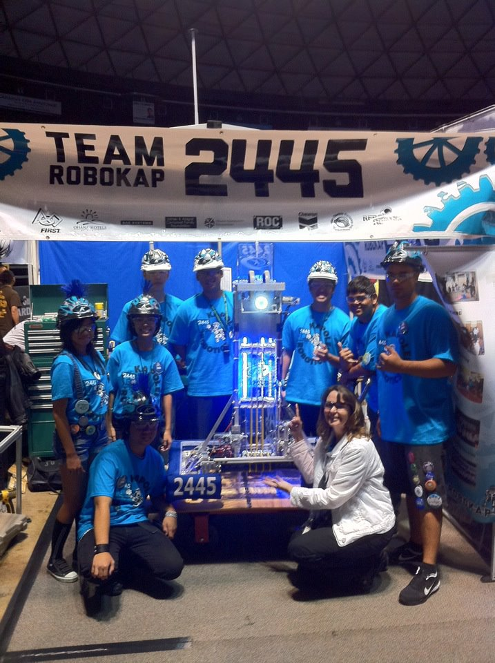
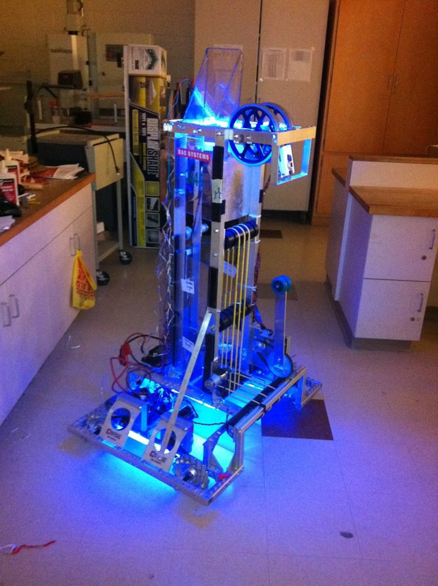

  
  
  

# The Game

Rebound Rumble was the competition in 2012 held by FIRST that allowed teams of students and teachers to compete in a robotic game. Each team was given 2 months to create a robot to participate in the competition. The robot had to shoot a foam basketball into the hoops on a 27' x 54 court. In the middle of the court there is a barier and the only way to cross it is through the tilting bridge. Each team can assign three people to drive their robot during the game, 2 drivers and 1 coach. You can learn about the game in full detail by watching this [video](https://www.youtube.com/watch?v=nOXsdhZZSdM&list=PL926CA30C6E7D9DCF&index=18).

# My Role

During the building season, I was a part of the design team. I had to design parts of the electronic board, chasis and the shooter. Our team used Solid Works to design our parts in 3d and print the schematics for the mechanical team to use. Our robot design allowed us to pick up foam balls on the ground and shoot them at the highest goal with good accuracy. During the competition, I was the coach for our drive team. I had to direct the drivers and decide what type of strategy we would use. We almost made it to the semifinals but fell a little short. Even though we did not make it to semifinals, I am still proud of how far I went in my first year of being on the high school robotics team.

# The learning experience

Being on the robotics team for the first time, I was completely lost. I learned all about the design process and engineering on this team. I realized how hard it was to design a product to do a task efficiently. I learned all electrical boards, and mechanical mechanisms. Also, I learned how to have fun while working! I really enjoyed what I was doing and what I was working for. Some people still do not know what they like to do as hobbies and some people do not pursue work that makes them happy.

You can learn more about the competition at the [First Website](http://www.firstinspires.org/robotics/frc).
