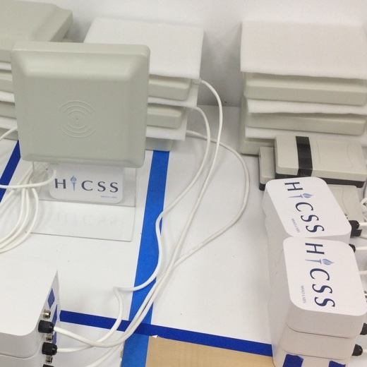

The [Hawaii International Conference on System Science (HICSS)](https://hicss.hawaii.edu) conference is an annual information system conference in Hawaii. HICSS accepts about 700 papers every year with an acceptance rate below 50%. Given these acceptance numbers and its conference locations, the conference is well-visited. During in-person conferences, this used to mean a quite hectic sign-in process and a lot of manual labor to track which sessions/topics are more popular than others. 

To address these issues, we developed an RFID based sign-in and tracking system in 2018 based on design ideas described in [this project](projects/iot-application-framework). By attaching low-cost RFID tags to each name badge and placing RFID scanners at both registration booths and presentation rooms, we can automate the manual labor of tracking the sign-in process and session attendance. COTS RFID antennas with a range of less than a foot were selected for the sign-in booths, and antennas with a range of up to 10feet for presentation rooms. Antennas were interfaced via serial communication to Raspberry Pi's. Data was agregated and send published using the MQTT protocol, which is fairly easy to do with Node-RED.  

My job was to store and display data so that organizers would have insights into some key indicators such as real-time number of sign-ins. We've iterated the system over the years from 2018 to 2020, and are looking forward to improving them further for the next in-person HICSS conference. One remaining open issue is the accuracy of session attendance data due to the wide range of the antennas and their placement near the entrances of the room. As people's behaviors vary, there is more data processing to be done to filter who is actually attending a session and who is just walking by or peaking in. The web system could also use a complete overhaul to improve its features and capabilities with respect to real-time reporting and data display.
