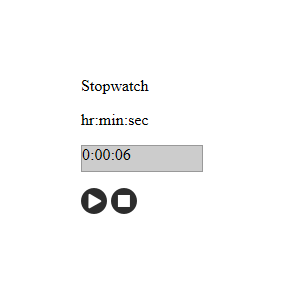

This is code for a javascript based stopwatch website. It counts down from a certain amount of time and displays a dialog box after the amount of time counts down to zero. 

View the code [here](https://github.com/matthew-schultz/javascriptTimeBank/tree/test).

