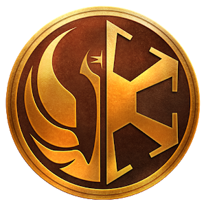

As I transitioned from the submarine work schedule of 90+ hours a week to civilian life, I became a frequent gamer on the new Star Wars MMORPG.  It was a way to spend time working together with others to accomplish common goals--in this case, exploring a virtual galaxy repeatedly defeating digital enemies.  It became more than just a game, as I made dozens of friends adventuring across the fictional Star Wars Universe.  Before I knew it, our grandmaster was stepping down and handed me the reins to our thriving guild of several hundred people.

I took the responsibility very seriously, and immediately set out with several goals: to help guildmates succeed with their in-game goals, to foster success of our guild overall, and to make sure we had a welcoming friendly environment with minimal drama.  Over the next few months my own gameplay took a backseat as I spent most time in-game addressing and solving guild problems while playing the in-game auction house to raise guild funds. I was even able to gain the assistance of several guild officers to whom I could discuss problem solving, and delegate tasks for which they were better suited.  Despite my preferences to take a more casual role and to play a stealth/dps/healer class, I also took on the responsibilities of Raid Leader and Main Tank to maximize our chances for good loot (The duty of Raid Leader involved knowing the raid and its boss fight strategies intimately, and handing out instructions and orders as the situation required for the group to overcome all challenges and receive the rewards.)  However, the sacifices were well worth it, as our guild expanded and thrived, and my guildmates had fun with each other and improved their game characters.

As time went on the game began to feel more and more like a second job, albeit an entertaining one I could spend while enjoying endless banter with my online friends.  However, I had decided to dedicate that large chunk of time to personal habits with more significant long-term benefits.  That being said, I wanted to leave my friends in the best position possible.  I spoke with my friends in-game outside the guild, and found two other guilds who were willing to merge.  This was a huge deal at the time, as the new guild spaceships could only be fully utilized by guilds with massive funding.  Despite many objections, setbacks, and close-calls, we were able to negotiate a merger into a super-guild, complete with a new name all current guildmasters and officers were satisfied with.  Ultimately, I was able to assist in making the leisure time of several hundred people across the world significantly more efficient and enjoyable.

I learned several important lessons from this experience.  First, I am willing and able to expend significant effort and sacrifices to make the future more efficient and enjoyable for those I care about.  Secondly, I had much more capabiity as a teammate and leader than I had ever thought possible--I was in charge of subordinates in the military, but it's a bit different when their paycheck and quality of life depends on following your orders.  Lastly, the time requirements of an MMO are incompatible with the life goals I have realized: being physically, mentally, and emotionally healthy; developing skills and experience to create challenging yet rewarding projects; and working as hard as necessary to help our world become a better place for everyone, now and in the future.
